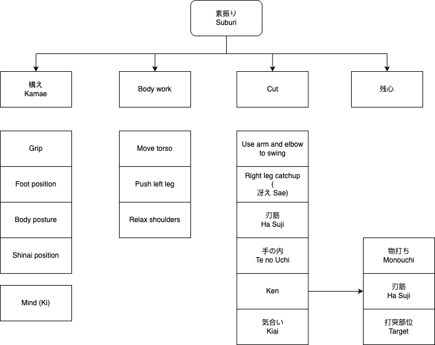

# Suburi

Version: 2025-06-03

Suburi is the basic of Kendo. Doing Suburi in a right path will get improved faster, otherwise it won't get improved.

This guide lists all points that should be paid attention to so that we can be sure we're walking on the right path.

It's not easy to check if we're doing right just by feeling because our eyes cannot see ourselves directly. The key is to get some feedbacks, like getting advide from Sensei, replaying video taps, using mirror, getting advice from fellows, etc. But getting feedbacks is not enough, we need to know why, why the advice works.

## Kamae

### Grip

- Use left and right hands' palm to hold the sword
    - [Carpal bones](https://en.wikipedia.org/wiki/Carpal_bones)
- Left hand should be naturally in front of abdomen, about 1 fist away
- Both hand should hold the Shinai over the top
- Both hand should hold Shinai tightly using middle, ring, and pinky finger
- The thumb and index finger should not squeeze the Shinai

### Foot position

- Both feet should point forward
- The left-to-right distance of two feet should be about the shoulder width
- Keep left heel up, and be ready to push the body
- Check distribution of weight, it should be easy to push the body forward

### Body posture

- Upper body should be straight, not lean forward
- Upper body, especially shoulder, should be relax
- Body should be facing forward, not to the left, not to the right
    - Face directly to the opponent

### Shinai/Bokuto position

- The blade should be facing down
- Tip of Shinai (Kensen) should point to opponent's eye or throat

### Mind (ki)

- Always watch the whole body of the opponent, not at a small area like Men, or Kote, or Do.

## Body work

- Push left leg to initiate a cut
- Always use foot power to drive torso movement, and spread the power to hand to Kensen (tip of Shinai) for swing
    - Tense shoulders block power from torso
- It takes time to feel how to use body muscles

## Cut (Strike)

- Use arm and elbow to swing the shinai, use power from torso
- Keep elbow close to body line, the elbow should move up and down, not left, not right.
- When striking, right leg should catch up and back to temporary kamae position
    - 冴え
- The trajectory of Shinai, should follow the blade
    - otherwise the blade will be broken
    - 刃筋
- Use Monouchi to hit the target, not too deep, not too shallow.
    - The correct area of Monouchi depends on the size of target, Kote is the smallest, Do is the biggest.
- Kiai means a spirit of dedication, shows to both self and opponent
    - It's also the easy way to synchronize the mind and body
    - It's like incantation of magic, similarly high rank Kenshi with strong Ki can skip the chanting

## Zanshin

- Evaluate all things above
- Prepare for the next cut
